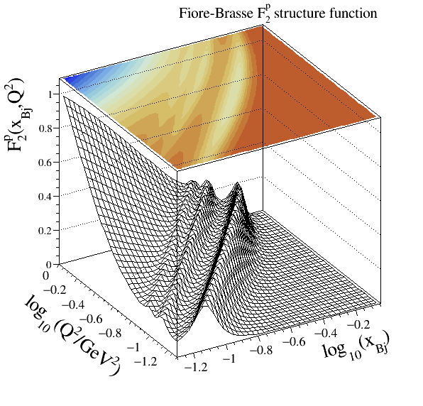

.. _strfun:

===================
Structure functions
===================

This documentation page lists all :math:`F_{2/L}(\xbj,Q^2)` nucleon structure functions types modelled and embedded in the CepGen library.
These modellings are intensively used in the photon fluxes computation, and each of these are tuned for a specific kinematics range.

All parameterisations derive from the following base class:

.. doxygenclass:: cepgen::strfun::Parameterisation
   :members:

.. note::
   All of these may be used and linked against any external code.

The parameterisation types handled in CepGen are listed in the following enumeration:

.. doxygenenum:: cepgen::strfun::Type

Below, a semi-detailed review of a subset of the modellings handled in CepGen is presented.

+--------------------------------------------------+----------+-------------+-------------+-------------------------------------------+
| Name                                             | Code     | :math:`F_2` | :math:`F_L` | Description                               |
+==================================================+==========+=============+=============+===========================================+
| LHAPDF                                           | 1MSSSSSS | 🆗          | 🔢          | parton-level :math:`F_{2/L}`              |
|                                                  |          |             |             |                                           |
|                                                  |          |             |             | * M = 0 (all partons)                     |
|                                                  |          |             |             | * M = 1 (valence)                         |
|                                                  |          |             |             | * M = 2 (sea)                             |
|                                                  |          |             |             |                                           |
|                                                  |          |             |             | SSSSSS = integer LHAPDF ID code           |
+--------------------------------------------------+----------+-------------+-------------+-------------------------------------------+

.. _suriyennie:

Suri-Yennie
~~~~~~~~~~~

.. note::
   * Legacy code: 11
   * Structure functions modelled: $F_E$, $F_M$

.. doxygenclass:: cepgen::strfun::SuriYennie
   :outline:

This set was used as a standard option in the LPAIR event generator.
It provides a reasonable description of SLAC data in the resonance and continuum regions.

.. _szczurekuleshchenko:

Szczurek-Uleshchenko
~~~~~~~~~~~~~~~~~~~~

.. note::
   * Legacy code: 12
   * Structure function modelled: $F_2$

.. doxygenclass:: cepgen::strfun::SzczurekUleshchenko
   :outline:

This set :cite:`Szczurek:1999wp` puts an emphasis on the low-to-intermediate $Q^2$ region and includes a smooth continuation to low-$Q^2$.

.. _bdh:

Block-Durand-Ha
~~~~~~~~~~~~~~~

.. note::
   * Legacy code: 13
   * Structure function modelled: $F_2$

.. doxygenclass:: cepgen::strfun::BlockDurandHa
   :outline:

.. This set :cite:`Szczurek:1999wp` puts an emphasis on the low-to-intermediate $Q^2$ region and includes a smooth continuation to low-$Q^2$.

Resonance models
~~~~~~~~~~~~~~~~

.. _fiorebrasse:

Fiore-Brasse
^^^^^^^^^^^^

.. note::
   * Legacy code: 101
   * Structure function modelled: $F_2$

.. doxygenclass:: cepgen::strfun::FioreBrasse
   :outline:

This parameterisation (described in :cite:`Fiore:2002re` and :cite:`Brasse:1976bf`) gives a very good description of photoabsorption in the resonance region from low to large $Q^2$.
Furthermore, it is extremely well reproducing JLAB data.

.. _christybosted:

Christy-Bosted
^^^^^^^^^^^^^^

.. note::
   * Legacy code: 102
   * Structure functions modelled: $F_2$, $F_L$

.. doxygenclass:: cepgen::strfun::ChristyBosted
   :outline:

The set developed by M.E. Christy and P.E. Bosted :cite:`Bosted:2007xd` is emphasised on the very-low :math:`Q^2` regime, with its particular use of JLAB's Hall-C data on:

* inclusive inelastic (up to :math:`Q^2\simeq` 7.5 GeV²),
* photoproduction at :math:`Q^2=` 0, and
* DIS data at high-:math:`(Q^2,W)`.

.. .. doxygennamespace:: cepgen::strfun
..    :members:
.. .. doxygennamespace:: mstw
..    :members:

Continuum models
~~~~~~~~~~~~~~~~

ALLM parameterisation
^^^^^^^^^^^^^^^^^^^^^

.. note::
   * Legacy codes: ``201`` (ALLM91), ``202`` (ALLM97), ``203`` (GD07p), ``204`` (GD11p)
   * Structure function modelled: $F_2$ [#f1]_

.. doxygenclass:: cepgen::strfun::ALLM
   :outline:

A full reference of this parameterisation by *Abramowicz et al.* can be found in :cite:`Abramowicz:1991xz` (``ALLM91``) and :cite:`Abramowicz:1997ms` (``ALLM97``).
The HERMES Collaboration refits of this modelling, labelled ``GD07p`` and ``GD11p`` may be found in :cite:`Airapetian:2011nu`.

In this continuum region modelling the $F_2$ proton structure function is parameterised as:

.. math::

   F_2(\xbj,Q^2) = \frac{Q^2}{Q^2+m_0^2}\left[F_2^{\Pom}(\xbj,Q^2)+F_2^{\Reg}(\xbj,Q^2)\right],

with $m_0$ the effective photon mass. The pomeron/reggeon exchanges terms are parameterised as:

.. math::

   F_2^{\Pom,\Reg}(\xbj,Q^2) = c^{\Pom,\Reg}(t) x _ {\Pom,\Reg}^{a^{\Pom,\Reg}(t)} (1-\xbj)^{b^{\Pom,\Reg}(t)},

with the slowly-varying function $t = t(Q^2)$ defined as:

.. math::

   t(Q^2) = \ln\left(\ln\frac{Q^2+Q_0^2}{\Lambda^2}\right)-\ln\left(\ln\frac{Q_0^2}{\Lambda^2}\right),

and the modified Bjorken-$x$ functions:

.. math::

   x _ {\Pom,\Reg} = \left(1+\frac{w^2-m_p^2}{Q^2+m _ {\Pom,\Reg}}\right)^{-1}.

The six functionals $a^{\\Pom,\\Reg}(t), b^{\\Pom,\\Reg}(t), c^{\\Pom,\\Reg}(t)$ are parameterised as:

.. math::

   a^{\Pom}(t) = a^{\Pom}_1+(a^{\Pom}_1-a^{\Pom}_2)\left[\frac{1}{1+t^{a^{\Pom}_3}}-1\right],\\
   b^{\Pom}(t) = b^{\Pom}_1 + b^{\Pom}_2 t^{b^{\Pom}_3},\\
   c^{\Pom}(t) = c^{\Pom}_1+(c^{\Pom}_1-c^{\Pom}_2)\left[\frac{1}{1+t^{c^{\Pom}_3}}-1\right]

for the pomeron part, and

.. math::

   a^{\Reg}(t) = a^{\Reg}_1 + a^{\Reg}_2 t^{a^{\Reg}_3},\\
   b^{\Reg}(t) = b^{\Reg}_1 + b^{\Reg}_2 t^{b^{\Reg}_3},\\
   c^{\Reg}(t) = c^{\Reg}_1 + c^{\Reg}_2 t^{c^{\Reg}_3},

for the reggeon subset.

Currently, four tunings of the 23 model parameters are embedded within CepGen:

+---------------------+------------+----------+----------+----------+----------+
| Parameter           | Units      | ALLM91   | ALLM97   | GD07p    | GD11p    |
+=====================+============+==========+==========+==========+==========+
| $m_0^2$             | GeV$^2$    | 0.30508  | 0.31985  | 0.454    | 0.5063   |
+---------------------+------------+----------+----------+----------+----------+
| $m _ {\\Pom}^2$     | GeV$^2$    | 10.676   | 49.457   | 30.7     | 34.75    |
+---------------------+------------+----------+----------+----------+----------+
| $m _ {\\Reg}^2$     | GeV$^2$    | 0.20623  | 0.15052  | 0.117    | 0.03190  |
+---------------------+------------+----------+----------+----------+----------+
| $Q_0^2$             | GeV$^2$    | 0.27799  | 0.52544  | 1.15     | 1.374    |
+---------------------+------------+----------+----------+----------+----------+
| $\\Lambda_0^2$      | GeV$^2$    | 0.06527  | 0.06527  | 0.06527  | 0.06527  |
+---------------------+------------+----------+----------+----------+----------+
| $a^{\\\Pom}_1$      | -          | -0.04503 | -0.0808  | -0.105   | -0.11895 |
+---------------------+------------+----------+----------+----------+----------+
| $a^{\\\Pom}_2$      | -          | -0.36407 | -0.44812 | -0.495   | -0.4783  |
+---------------------+------------+----------+----------+----------+----------+
| $a^{\\Pom}_3$       | -          | 8.17091  | 1.1709   | 1.29     | 1.353    |
+---------------------+------------+----------+----------+----------+----------+
| $b^{\\Pom}_1$       | -          | 0.49222  | 0.36292  | -1.42    | 1.0833   |
+---------------------+------------+----------+----------+----------+----------+
| $b^{\\Pom}_2$       | -          | 0.52116  | 1.8917   | 4.51     | 2.656    |
+---------------------+------------+----------+----------+----------+----------+
| $b^{\\Pom}_3$       | -          | 3.5515   | 1.8439   | 0.551    | 1.771    |
+---------------------+------------+----------+----------+----------+----------+
| $c^{\\Pom}_1$       | -          | 0.26550  | 0.28067  | 0.339    | 0.3638   |
+---------------------+------------+----------+----------+----------+----------+
| $c^{\\Pom}_2$       | -          | 0.04856  | 0.22291  | 0.127    | 0.1211   |
+---------------------+------------+----------+----------+----------+----------+
| $c^{\\Pom}_3$       | -          | 1.04682  | 2.1979   | 1.16     | 1.166    |
+---------------------+------------+----------+----------+----------+----------+
| $a^{\\Reg}_1$       | -          | 0.60408  | 0.584    | 0.374    | 0.3425   |
+---------------------+------------+----------+----------+----------+----------+
| $a^{\\Reg}_2$       | -          | 0.17353  | 0.37888  | 0.998    | 1.0603   |
+---------------------+------------+----------+----------+----------+----------+
| $a^{\\Reg}_3$       | -          | 1.61812  | 2.6063   | 0.775    | 0.5164   |
+---------------------+------------+----------+----------+----------+----------+
| $b^{\\Reg}_1$       | -          | 1.26066  | 0.01147  | 2.71     | -10.408  |
+---------------------+------------+----------+----------+----------+----------+
| $b^{\\Reg}_2$       | -          | 1.83624  | 3.7582   | 1.83     | 14.857   |
+---------------------+------------+----------+----------+----------+----------+
| $b^{\\Reg}_3$       | -          | 0.81141  | 0.49338  | 1.26     | 0.07739  |
+---------------------+------------+----------+----------+----------+----------+
| $c^{\\Reg}_1$       | -          | 0.67639  | 0.80107  | 0.838    | 1.3633   |
+---------------------+------------+----------+----------+----------+----------+
| $c^{\\Reg}_2$       | -          | 0.49027  | 0.97307  | 2.36     | 2.256    |
+---------------------+------------+----------+----------+----------+----------+
| $c^{\\Reg}_3$       | -          | 2.66275  | 3.4942   | 1.77     | 2.209    |
+---------------------+------------+----------+----------+----------+----------+

The ALLM91 tuning is fitted from all pre-HERA data points available.

.. _allm91:

.. _allm97:

.. _gd07p:

.. _gd11p:

Perturbative models
~~~~~~~~~~~~~~~~~~~

MSTW grid
^^^^^^^^^

.. [#f1]
   This (set of) structure function(s) is/ar only defining :math:`F_2` and use the :math:`R` modelling-dependent relation:

   .. math::

      F_L(\xbj,Q^2) = \left(1+\frac{4m_p^2\xbj^2}{Q^2}\right)\frac{R}{1+R}F_2(\xbj,Q^2).

References
~~~~~~~~~~

.. bibliography:: _static/bibliography.bib
   :cited:
